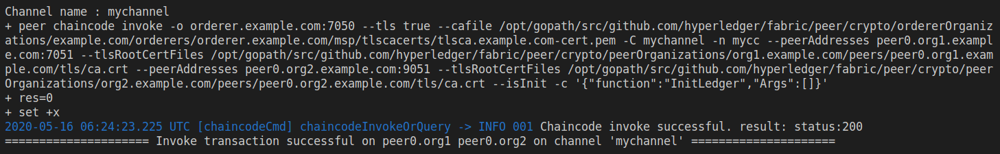
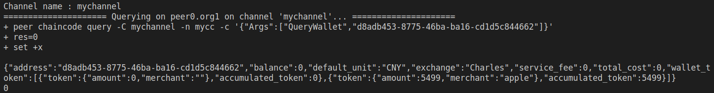

# FABRIC NETWORK

* 开发了基于Hyperledger Fabric的钱包积分(代币)系统
* 组织个数：2，每个组织节点数：2
* 链码使用Golang开发，功能包括账本初始化，钱包创建、删除钱包、查询钱包、获取积分(代币)等五个功能。

## 运行结果
* 账本初始化结果：

* 钱包创建结果：

* 删除钱包结果：

* 查询钱包结果：

* 获取积分(代币)结果：
